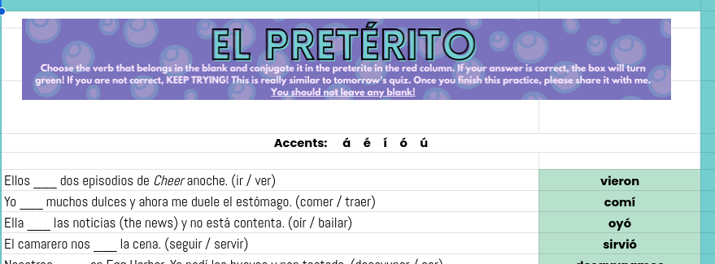
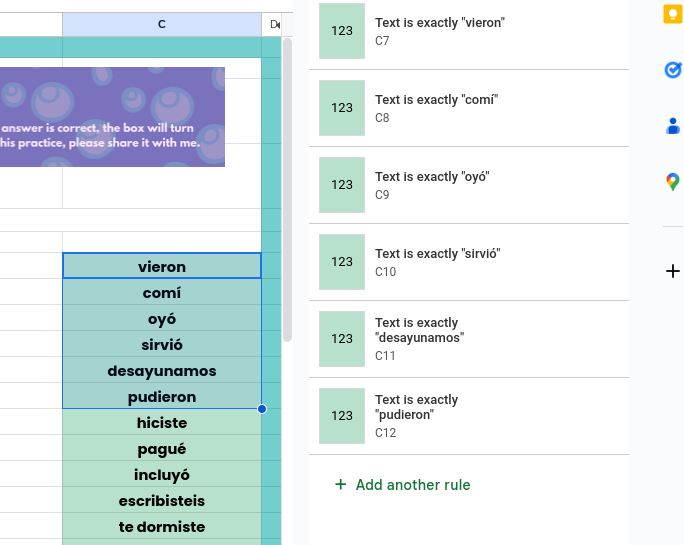

# Find answers to Google Sheet based homeworks

If your homework on Google Sheets has a feature where it will perform an action when you type in something (ex. cell becoming green when you type in the correct answer), you can just find what triggers that thing to happen which will leak the answer.

> If your answer is correct, the box will turn green!

Well yeah if you highlight and right click on the cell that gets affected when you type something in correctly, and then choose Conditional format rules, it will give you the exact text that you need to input. I found this info from [this tutorial for teachers](https://lindsaybowden.com/how-to-make-math-pixel-art/).

This is not hard to figure out if you know Google Sheets stuff but I find it kinda cool.